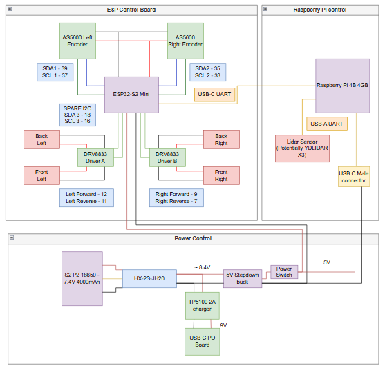

# RovRover PlatformIO Project

This project runs the RovRover driver deployed on a ESP32-S2 Mini board.

To edit pinouts and config, check the `Roverconfig.h` file, this program is deployed via the PlatformIO extention see [PlatformIO documentation](https://docs.platformio.org/) for more details.

This firmware provides control for the onboard motor drivers and encoders via UART control (baud rate 115200).

This ESP only handles the motors and encoders for basic SLAM, it assumes another device will handle the Lidar

A wiring diagram of the system can be seen here.

## Structure
- `src/` — Main source code
- `include/` — Header files
- `platformio.ini` — PlatformIO configuration

## Commands
- `Update Encoders` - `ENC`
- `Velocity` - `VEL <linear_velocity> <angular_velocity>`
- `Distance` - `DIST` returns: `DIST <left_distance> <right_distance> <milis>`
- `Angle` - `ANGLE` returns: `ANGLE <left_raw_angle> <right_raw_angle> <milis>` 

## Quick Start
1. Open this folder in VS Code with PlatformIO extension installed.
2. Select your board in `platformio.ini` (although only the ESP32-S2 Mini is setup)
3. Build, Upload & Monitor via PlatformIO

## Author
- [Anthony Bebek](https://github.com/AnthonyBebek) 