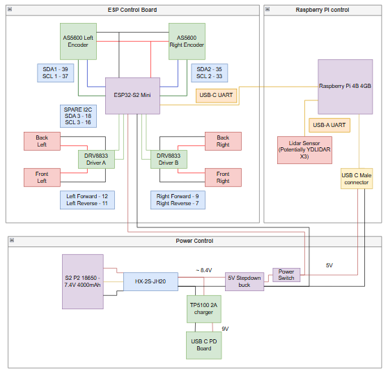

# RovRover PlatformIO Project

This project runs the RovRover driver deployed on a ESP32-S2 Mini board.

To edit pinouts and config, check the `Roverconfig.h` file, this program is deployed via the PlatformIO extention see [PlatformIO documentation](https://docs.platformio.org/) for more details.

This firmware provides control for the onboard motor drivers and encoders via UART control (baud rate 115200).

This ESP only handles the motors and encoders for basic SLAM, it assumes another device will handle the Lidar

A wiring diagram of the system can be seen here.

## Structure
- `src/` — Main source code
- `include/` — Header files
- `platformio.ini` — PlatformIO configuration

## Commands
- `Update Encoders` - `ENC`
- `Velocity` - `VEL <linear_velocity> <angular_velocity>`
- `Distance` - `DIST` returns: `DIST <left_distance> <right_distance> <milis>`
- `Angle` - `ANGLE` returns: `ANGLE <left_raw_angle> <right_raw_angle> <milis>` 

## Quick Start
1. Open this folder in VS Code with PlatformIO extension installed.
2. Select your board in `platformio.ini` (although only the ESP32-S2 Mini is setup)
3. Build, Upload & Monitor via PlatformIO
> [!NOTE]
> On some Linux systems (e.g. Kubuntu), automatic reset into bootloader mode may fail for ESP32-S2 boards using native USB (CDC).
>
> If uploads hang at "Connecting...", use manual boot mode:
> 1. Hold BOOT (GPIO0)
> 2. Press and release RESET
> 3. Release BOOT after a second
> 4. Retry upload immediately
>
> If issues persist, USB serial control lines can be disabled with:
> `sudo stty -F /dev/ttyACM0 -hupcl`
>
> Then use the manual boot procedure above.
>
> Note: The device path (/dev/ttyACM0) may vary between connections.
>
>
> Additionally, because platformIO takes a while before it actually uploads the code, its recommended to compile the bin via platformIO then upload with the command:
> `python3 -m esptool --chip esp32s2 --port /dev/ttyACM0 write_flash 0x10000 .pio/build/lolin_s2_mini/firmware.bin`
>
> Note: The device path (/dev/ttyACM0) may vary between connections.

## Author
- [Anthony Bebek](https://github.com/AnthonyBebek) 